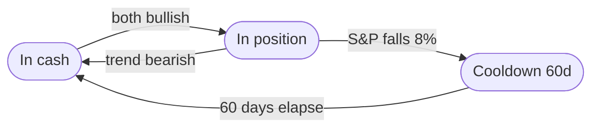

# TQQQ-Trend-Follower-Bot

### **Project Overview**
This project is an automated trading monitor system designed for long-term investors tracking 3x leveraged ETFs like TQQQ. It layers a **200-Day SMA + ATR trend signal**, **dual-signal agreement** (the NASDAQ-100 and S&P 500 must concur), and a **trailing stop** for crash protection into a single daily recommendation — aiming to compound through bull markets while exiting defensively before systemic drawdowns. See [How It Works](#how-it-works) for the mechanics.

---

### How It Works

`bot.py` produces one daily recommendation by stacking three layers, each fixing a weakness of the layer before it. The Discord report shows the underlying signals for transparency, but the headline **recommended action** is the combined verdict of all three.

#### Layer 1 — The core trend signal (SMA 200 + ATR buffer)

Each index's trend is classified against a 200-day Simple Moving Average with a volatility buffer sized by **Average True Range (ATR)** — "breathing room" that widens in volatile markets and tightens in calm ones, so the strategy adapts instead of reacting to every minor wiggle:

*   **Bullish** — price above the upper buffer: `Price > SMA200 + 2.5 * ATR` → enter or hold to capture growth.
*   **Bearish** — price below the lower buffer: `Price < SMA200 - 2.5 * ATR` → exit to cash or short-term Treasuries (e.g. SGOV/BIL) to protect capital.
*   **Neutral** — price inside the buffer → hold the current position (prevents "whipsawing" during indecisive markets).

#### Layer 2 — A noise filter: dual-signal agreement

A single band crossing can be a one-day head-fake. Two ways to filter that noise were tested:

*   **T+2 confirmation** — a new signal must persist **2 consecutive trading days** before acting (temporal persistence). Used in the single-signal setups and Tables 1–3.
*   **Dual-signal agreement** — flip state only when **both** the NASDAQ-100 (^NDX) *and* the S&P 500 (^GSPC) independently agree; if they disagree, hold the prior position (cross-index persistence).

`bot.py` uses **dual-signal agreement** as its noise filter — not T+2, since stacking both is redundant (see Table 4). It still trades ^NDX (TQQQ) exposure; the S&P is a second confirming vote, not a separate position.

#### Layer 3 — The trailing stop (crash protection)

The trend signal is deliberately slow, so a sharp crash can inflict heavy damage before it confirms a bearish turn. The trailing stop is a faster safety net on top:

*   While in a position, track the **running peak of the (unleveraged) S&P 500 price** since entry.
*   The day the S&P closes **8% below that peak**, exit immediately — bypassing the dual-signal delay entirely.
*   After a stop-triggered exit, block re-entry for a **60-trading-day cooldown**, so a still-elevated trend signal doesn't buy straight back into a falling market.

It tracks the *unleveraged* S&P price, not the 3x equity curve — the leveraged curve swings ~3× as hard and would trip the stop constantly. The stop is opt-in; `bot.py` runs it at 8% / 60d.

The **recommended action** is "in the market" only when both indices agree bullish **and** the trailing stop has not fired. The daily report prints this action twice — once for a **tax-advantaged account** (with the trailing stop) and once for a **taxable account** (dual-signal only, *without* the stop), because Table 8 shows the stop's extra turnover is a net-negative return trade after tax. Full validation of the trailing stop — out-of-sample generalization, parameter stability, execution cost, and crash-event behavior — lives in the [`docs/`](docs/) finding chain (`docs/trailing-stop-*`, `docs/combined-system-comparison-2026-08-03.md`).

---

### Backtesting Methodology

All results below are produced by rolling 26-year backtests stepped forward **monthly** from the earliest available data through the latest valid start date (2000-07). This eliminates timing luck and exposes strategies to every major market regime — the Dot-com crash, 2008 Financial Crisis, COVID crash, and the 2022 rate-shock bear market.

**Key engine features:**
- **Next-day open execution** — orders execute at the following day's open, not the signal day's close
- **Accurate TWR annualisation** — computed from actual trading days, not configured period years
- **Historical borrow rates** — leverage drag uses era-accurate interest rates (4%–9% depending on decade)
- **Cash yield** — idle cash earns 80% of the prevailing borrow rate (money-market proxy)
- **Parallel computation** — all rolling windows run concurrently via `ThreadPoolExecutor`

**Two drawdown metrics** (both reported in the rolling tables below):
- **Worst DD** — the deepest **peak-to-trough** decline (trough ÷ the strategy's own *running peak* − 1). Measures giving back accumulated *paper gains*.
- **Worst DD vs Init** — the deepest dip below the **initial $10,000** (lowest equity ÷ *starting capital* − 1; 0 means a window never went below the money put in). Measures losing your *own principal*. For a strategy that has compounded a lot, Worst DD can be far deeper than Worst DD vs Init — the difference is gains-given-back vs. principal-lost. The gap is near-zero for setups whose worst window starts right before a crash (no gains banked yet — pure sequence risk).

**Backtest Parameters:**
- Rolling period: **26 years** per window
- Initial investment: **$10,000 lump sum** (no DCA)
- Tax: **not applied** (pre-tax returns)

---

## Backtest Results

- **Tables 1–3** — strategy comparison (SMA 200 vs EMA 50/200 vs Buy & Hold vs VIX/RSI) across signal sources and leverage tiers.
- **Table 4** — signal-source comparison (NDX vs S&P 500 vs dual-signal agreement), plus the trailing-stop overlay on the two most relevant setups.
- **Table 5** — drawdown by crash event, per strategy (now including the velocity-stop rows E/F).
- **Table 6** — velocity (fixed-window) stop vs. the peak-based trailing stop, on both the rolling-return and crash-event lenses.
- **Table 7** — QQQ (1x) strategy comparison, cross-validating Table 1's 1x tier and adding dual-signal/trailing-stop rows.
- **Table 8** — taxable account: pre-tax vs. after-tax returns for the peak stop vs. no stop.
- **Table 9** — global equities (MSCI World + EM → VT splice): the Table 2 strategy comparison applied to a reconstructed global-equity base back to 1985 (tracks real VT at monthly R² 0.98 over their overlap).

### Table 1: NASDAQ-100 (^NDX) — Lump Sum Performance
*Date range: 1986-04-29 to 2000-07-28 (172 rolling windows)*

| Leverage | Strategy | Avg TWR | Med TWR | Worst TWR | Worst DD | Avg Trades |
| :--- | :--- | ---: | ---: | ---: | ---: | ---: |
| **3x** | Buy & Hold | 3.10% | 3.84% | -9.09% | -99.98% | 1 |
| **3x** | **SMA 200 (ATR x2.5, T+2)** | **23.33%** | **24.25%** | **11.21%** | **-84.99%** | **13** |
| **3x** | EMA 50/200 | 23.52% | 25.05% | 10.81% | -90.41% | 13 |
| **3x** | VIX < 25 | -1.84% | -1.10% | -10.36% | -99.85% | 124 |
| **3x** | RSI 30/70 | -5.70% | -5.81% | -12.73% | -99.85% | 22 |
| | | | | | | |
| **2x** | Buy & Hold | 11.17% | 11.83% | 1.54% | -98.95% | 1 |
| **2x** | **SMA 200 (ATR x2.5, T+2)** | **20.57%** | **21.16%** | **11.42%** | **-66.80%** | **13** |
| **2x** | EMA 50/200 | 21.04% | 21.72% | 11.57% | -73.90% | 13 |
| **2x** | VIX < 25 | 3.48% | 4.20% | -3.20% | -98.17% | 124 |
| **2x** | RSI 30/70 | 1.75% | 1.81% | -2.76% | -96.66% | 22 |
| | | | | | | |
| **1x** | Buy & Hold | 11.65% | 12.06% | 6.12% | -82.99% | 1 |
| **1x** | **SMA 200 (ATR x2.5, T+2)** | **13.89%** | **14.10%** | **8.70%** | **-35.77%** | **13** |
| **1x** | EMA 50/200 | 14.31% | 14.56% | 8.99% | -39.94% | 13 |
| **1x** | VIX < 25 | 5.52% | 6.03% | 1.55% | -83.44% | 124 |
| **1x** | RSI 30/70 | 4.86% | 4.86% | 3.28% | -74.40% | 22 |

> **Bold = best risk-adjusted result per leverage tier.** With T+2 confirmation, SMA 200 (ATR x2.5) runs essentially neck-and-neck with EMA 50/200 on average TWR at every tier (within ~0.5pp) and consistently posts a shallower max drawdown (-84.99% vs -90.41% at 3x, -66.80% vs -73.90% at 2x, -35.77% vs -39.94% at 1x). The worst-case floor, though, is mixed: SMA has the better floor at 3x (11.21% vs EMA's 10.81%), but EMA has a modestly higher floor at 2x (11.57% vs 11.42%) and 1x (8.99% vs 8.70%). The consistently lower drawdown across all three tiers is what keeps SMA the preferred strategy for leveraged exposure.

---

### Table 2: S&P 500 (^GSPC) — Lump Sum Performance
*Date range: 1985-07-31 to 2000-07-28 (181 rolling windows)*

| Leverage | Strategy | Avg TWR | Med TWR | Worst TWR | Worst DD | Avg Trades |
| :--- | :--- | ---: | ---: | ---: | ---: | ---: |
| **3x** | Buy & Hold | 2.75% | 3.34% | -2.54% | -98.86% | 1 |
| **3x** | SMA 200 (ATR x2.5, T+2) | 10.97% | 11.33% | 5.50% | -82.28% | 11 |
| **3x** | **EMA 50/200** | **11.60%** | **11.88%** | **6.73%** | **-79.40%** | **12** |
| **3x** | VIX < 25 | 0.64% | 0.88% | -2.94% | -95.46% | 123 |
| **3x** | RSI 30/70 | 3.95% | 4.52% | 0.08% | -95.10% | 23 |
| | | | | | | |
| **2x** | Buy & Hold | 6.37% | 6.70% | 3.38% | -91.49% | 1 |
| **2x** | SMA 200 (ATR x2.5, T+2) | 9.81% | 10.02% | 6.43% | -63.45% | 11 |
| **2x** | **EMA 50/200** | **10.40%** | **10.50%** | **7.44%** | **-59.38%** | **12** |
| **2x** | VIX < 25 | 2.65% | 2.87% | 0.06% | -83.34% | 123 |
| **2x** | RSI 30/70 | 6.01% | 6.03% | 4.06% | -81.45% | 23 |
| | | | | | | |
| **1x** | Buy & Hold | 6.99% | 7.08% | 5.33% | -56.90% | 1 |
| **1x** | SMA 200 (ATR x2.5, T+2) | 7.49% | 7.66% | 5.48% | -34.45% | 11 |
| **1x** | **EMA 50/200** | **7.88%** | **8.08%** | **6.02%** | **-33.26%** | **12** |
| **1x** | VIX < 25 | 3.85% | 4.03% | 2.23% | -46.92% | 123 |
| **1x** | RSI 30/70 | 5.78% | 5.80% | 4.94% | -52.65% | 23 |

> **With T+2 confirmation, EMA 50/200 overtakes SMA 200 on the S&P 500 signal** — higher average TWR *and* a shallower max drawdown at every leverage tier (e.g. at 1x: 7.88% avg / -33.26% DD for EMA vs 7.49% avg / -34.45% DD for SMA). This reverses the pre-T+2 result, where SMA led on ^GSPC — consistent with the two-day confirmation delay costing SMA more in lost entry/exit timing than it saves in avoided whipsaws, though this comparison isn't a controlled same-window ablation (the window set itself also shifted between the pre- and post-T+2 numbers), so treat the causal read as a plausible hypothesis rather than a proven mechanism. `bot.py` displays each index's T+2-confirmed SMA trend as a component monitor (its headline recommendation now layers dual-signal agreement + a trailing stop on top — see [How It Works](#how-it-works) and Table 4) — Table 1 continues to support the SMA choice on the NASDAQ-100 signal, while this table shows EMA would historically have done better specifically on the S&P 500 signal.

---

### Table 3: NASDAQ-100 Returns + S&P 500 Signal — Lump Sum Performance
*Trade ^NDX (TQQQ) exposure but use ^GSPC (S&P 500) trend to determine in/out.*
*Date range: 1986-04-29 to 2000-07-28 (172 rolling windows)*

| Leverage | Strategy | Avg TWR | Med TWR | Worst TWR | Worst DD | Avg Trades |
| :--- | :--- | ---: | ---: | ---: | ---: | ---: |
| **3x** | Buy & Hold | 3.10% | 3.84% | -9.09% | -99.98% | 1 |
| **3x** | SMA 200 (ATR x2.5, T+2) | 21.77% | 22.13% | 8.31% | -83.40% | 11 |
| **3x** | **EMA 50/200** | **22.93%** | **23.50%** | **9.02%** | **-88.61%** | **12** |
| **3x** | VIX < 25 | -1.84% | -1.10% | -10.36% | -99.85% | 124 |
| **3x** | RSI 30/70 | 3.74% | 3.64% | -0.89% | -99.39% | 23 |
| | | | | | | |
| **2x** | Buy & Hold | 11.17% | 11.83% | 1.54% | -98.95% | 1 |
| **2x** | SMA 200 (ATR x2.5, T+2) | 19.33% | 19.75% | 9.41% | -64.11% | 11 |
| **2x** | **EMA 50/200** | **20.41%** | **20.96%** | **10.12%** | **-70.83%** | **12** |
| **2x** | VIX < 25 | 3.48% | 4.20% | -3.20% | -98.17% | 124 |
| **2x** | RSI 30/70 | 8.17% | 8.01% | 5.52% | -92.72% | 23 |
| | | | | | | |
| **1x** | Buy & Hold | 11.65% | 12.06% | 6.12% | -82.99% | 1 |
| **1x** | SMA 200 (ATR x2.5, T+2) | 13.21% | 13.74% | 7.68% | -35.77% | 11 |
| **1x** | **EMA 50/200** | **13.89%** | **14.47%** | **8.17%** | **-40.11%** | **12** |
| **1x** | VIX < 25 | 5.52% | 6.03% | 1.55% | -83.44% | 124 |
| **1x** | RSI 30/70 | 7.99% | 7.88% | 6.60% | -64.15% | 23 |

> **vs. Table 1 (NDX own signal) and Table 2 (^GSPC own signal):** Table 3 inherits the same GSPC-signal
> dynamic seen in Table 2 — EMA 50/200 leads on average TWR, median TWR, and worst-case return at every
> leverage tier (e.g. at 1x: 13.89% vs SMA's 13.21% avg TWR). Drawdown, though, tells a different story
> than Table 2: SMA 200 (ATR x2.5) posts the shallower max drawdown at every tier (-83.40% vs -88.61% at
> 3x, -64.11% vs -70.83% at 2x, -35.77% vs -40.11% at 1x) — a consistent split by metric rather than the
> across-the-board EMA sweep seen in Table 2. This is the same returns-vs-drawdown trade-off Table 1
> shows, except here EMA's return edge is larger and extends to the worst-case floor at every tier too
> (not just some, as in Table 1), so EMA keeps the bold as the stronger overall pick on this signal —
> SMA remains the lower-drawdown alternative for anyone weighting capital preservation more heavily.

---

### Table 4: 3x ^NDX (TQQQ) — Signal Source Comparison (NDX vs S&P 500 vs Dual-Signal Agreement), with Trailing-Stop Overlay
*^NDX base, 3x leverage, SMA 200 (ATR x2.5 — `bot.py`'s current default) only. Compares three ways to generate the trend signal — NDX's own trend, the S&P 500's trend, and a "dual-signal agreement" hybrid that only acts when both trends agree — each with and without T+2 confirmation. The last two rows add an opt-in ^GSPC trailing stop (8% below peak since entry, 60-day re-entry cooldown) to the two most relevant setups.*
*Date range: 1986-04-29 to 2000-07-28 (172 rolling windows).*

> **Dual-signal agreement (no T+2) wins on every return metric, with the fewest trades of any setup here:** Avg TWR 25.81%, Med TWR 26.68%, 9 trades — vs. 23.53%/23.56% Avg TWR and 12-15 trades for the single-signal setups. Its worst-case drawdown (-84.95%) isn't the shallowest in this table (NDX-own with no T+2 is -81.38%), so it's not a strict win on every axis, but it's the strongest combination of return and trade efficiency tested.
>
> **Adding T+2 confirmation to the dual-signal hybrid makes it worse, not better** (25.81% -> 24.16% Avg TWR, drawdown also slightly deeper, -84.95% -> -85.50%) — cross-signal agreement and T+2 are both noise-filtering mechanisms aimed at the same problem (false signals/whipsaws), so stacking both appears partly redundant: each adds entry/exit delay without a matching benefit once the other is already filtering. The same direction held for both single-signal setups too: T+2 lowered Avg TWR for NDX-own (23.53% -> 23.33%) and, more sharply, for the S&P signal (23.56% -> 21.77%).
>
> **The trailing-stop overlay (last two rows) buys the lowest drawdown in the table** — Worst DD -64.78% vs. -83% to -85% for every no-stop setup — for roughly double the trading (9-11 -> 18 trades) and a near-flat return effect (S&P+T+2 22% -> 23%; dual-signal 26% -> 25%). Its full validation — out-of-sample generalization, parameter stability, execution-cost, and event-relative behavior — lives in the `docs/trailing-stop-*` and `docs/combined-system-comparison-2026-08-03.md` finding chain, which is why it is presented here as an overlay on the two most relevant setups rather than swept across all six.

| Setup | Avg TWR | Med TWR | Worst TWR | Worst DD | Worst DD vs Init | Avg Trades |
| :--- | ---: | ---: | ---: | ---: | ---: | ---: |
| NDX own signal | 23.53% | 24.25% | 10.53% | -81.38% | -81.38% | 15 |
| NDX own signal [T+2] | 23.33% | 24.25% | 11.21% | -84.99% | -84.75% | 13 |
| S&P 500 signal | 23.56% | 23.95% | 12.04% | -83.79% | -83.79% | 12 |
| S&P 500 signal [T+2] | 21.77% | 22.13% | 8.31% | -83.40% | -83.40% | 11 |
| **Dual-signal agreement** | **25.81%** | **26.68%** | 11.68% | -84.95% | -84.95% | **9** |
| Dual-signal agreement [T+2] | 24.16% | 25.24% | 9.41% | -85.50% | -85.27% | 9 |
| S&P 500 signal [T+2] + Trailing Stop 8%/60d | 23.43% | 23.92% | 12.30% | **-64.78%** | -54.76% | 18 |
| Dual-signal agreement + Trailing Stop 8%/60d | 24.59% | 25.36% | 12.92% | **-64.78%** | -54.75% | 18 |

> **Caveats, and how this table differs from the version it replaced:** this run is a single ATR value (2.5, `bot.py`'s current default) and SMA only — unlike the version of this table it replaced, it does not sweep ATR or test EMA (that data is preserved in `CHANGELOG.md`'s history if needed). It has also had lighter review than the rest of this README: `DualSignalAgreement` (`backtest/strat_backtest.py`) is new code, verified by hand-tracing its logic, confirming ^NDX's trading calendar is a strict subset of ^GSPC's (no date-alignment gaps), and cross-validating this table's NDX-own and S&P-signal rows against Table 1 and Table 3's already-published, independently-reviewed numbers (both matched exactly) — but the dual-signal logic itself has not been through the same multi-round adversarial review the rest of this README's findings have. The usual overlapping-window caveat also applies: 172 monthly-stepped windows share nearly all their history with their neighbors, so this is much less independent evidence than "172" suggests, and this is a single run — not itself checked for parameter stability or out-of-sample generalization the way earlier findings in this README were.

---

### Table 5: 3x ^NDX (TQQQ) — Drawdown by Crash Event (Event-Relative Peak-to-Trough)
*^NDX base, 3x leverage, S&P 500 signal. Each cell is the equity decline from just before the event to the local trough within the event window — a direct read of how the Table 4 setups weathered the five worst crashes in the sample. Less negative = better protected. Generated by `backtest/crash_event_drawdown.py`.*

> **The trailing stop is the single largest drawdown reducer in every crash**, and it helps all five with none worsened: Black Monday -66% -> -20%, dot-com -83% -> -51%, COVID -70% -> -43%. **Buy & Hold at 3x is ruinous** — the dot-com crash took it to -99.95% (near-total wipeout), the floor the trend rules improve on. The two stopped setups are nearly identical (the ^GSPC stop dominates the crash profile regardless of entry rule; only 2008 differs), and dual-signal without a stop is slightly *worse* than the S&P signal in 2008/2022 — the higher-return, higher-drawdown trade the stop then closes. Rows E and F add the velocity (fixed-window) stop; see [Table 6](#table-6-velocity-fixed-window-stop-vs-peak-based-stop) for the read across both this crash-event lens and the rolling-return lens.

| Setup | Black Monday 1987 | Dot-com crash | 2008 GFC | COVID crash | 2022 rate-shock bear |
| :--- | ---: | ---: | ---: | ---: | ---: |
| Buy & Hold (3x) | -83.66% | -99.95% | -94.57% | -69.96% | -80.15% |
| A: S&P 500 signal [T+2] (baseline) | -65.91% | -83.25% | -31.77% | -69.61% | -51.69% |
| B: S&P 500 signal [T+2] + Trailing Stop 8%/60d | **-19.55%** | **-51.11%** | **-17.95%** | **-42.69%** | **-38.06%** |
| C: Dual-signal agreement | -65.91% | -83.65% | -43.69% | -69.96% | -53.33% |
| D: Dual-signal agreement + Trailing Stop 8%/60d | -19.55% | -51.11% | -23.88% | -42.69% | -38.06% |
| E: Dual-signal agreement + Velocity Stop 6%/60d rolling_max | -15.47% | **-6.45%** | -21.42% | **-25.58%** | -30.03% |
| F: Dual-signal agreement + Velocity Stop 6%/30d point_to_point | -19.55% | -43.48% | **-11.16%** | -42.69% | -38.06% |

---

### Table 6: Velocity (Fixed-Window) Stop vs. Peak-Based Stop
*^NDX base, 3x leverage, ^GSPC reference. The peak-based trailing stop (Tables 4/5) exits when price falls a fixed pct below the running peak since entry. The velocity stop instead measures decline over a fixed trailing window instead of since-entry — `rolling_max` compares the latest close against the window's own max, `point_to_point` compares it against the close exactly `window` days earlier — testing whether a faster, window-bounded read catches sharp ("crazy") bears without over-reacting to slow ones. Winners selected from a 72-variant grid (mode x window x pct x cooldown) ranked by improvement over baseline event decline (`backtest/velocity_stop_sweep.py`): **rolling_max 6%/60d-window/60d-cooldown** and **point_to_point 6%/30d-window/60d-cooldown**.*

> **Crash-event lens (Table 5, rows E/F vs. D): the velocity stop does not leak on slow bears — the opposite of the a-priori hypothesis.** The worry going in was that a fixed-window stop, built to catch fast crashes, would fail to trigger on slower-grinding bears like dot-com (1999-2000) and 2022. It didn't: rolling_max (E) is dramatically better than the peak stop (D) on dot-com (-6.45% vs. -51.11%) and better on 2022 (-30.03% vs. -38.06%); point_to_point (F) also beats D on dot-com (-43.48% vs. -51.11%) and matches it exactly on 2022 (-38.06%). Both velocity variants match or beat the peak stop on all five crash events, not just these two.
>
> **Rolling-return lens (172-window aggregate below): the velocity stop underperforms the peak stop, and the trade-off is real, not free.** Avg TWR for the velocity variants clusters at 18.36%-21.58%, versus 24.59% for the peak stop and 25.81% for the dual-signal baseline with no stop at all — a return cost roughly 3-6x the peak stop's own (already-flat-to-negative) cost. It also trades *more* often (21-30 trades vs. the peak stop's 18, and dual-signal-no-stop's 9), not less — so the a-priori "does it whipsaw less" half of the question resolves **no**: the velocity stop does not reduce trading frequency; if anything it increases it.
>
> **Net read: the velocity stop is not a strictly better version of the peak stop — it is a more conservative one.** It buys equal-or-better crash protection at a real, larger compounding cost, with more trades along the way. Whether that trade is worth it depends on how much weight is put on tail protection during the specific slow-bear scenarios (dot-com, 2022) the peak stop already handles reasonably well.

| Setup | Avg TWR | Med TWR | Worst TWR | Worst DD | Worst DD vs Init | Avg Trades | Windows |
| :--- | ---: | ---: | ---: | ---: | ---: | ---: | ---: |
| Dual-signal agreement (no stop) | **25.81%** | 26.68% | 11.68% | -84.95% | -84.95% | **9** | 172 |
| Dual-signal agreement + Trailing Stop 8%/60d (peak anchor) | 24.59% | 25.36% | 12.92% | -64.78% | -54.75% | 18 | 172 |
| S&P 500 signal [T+2] + Velocity Stop rolling_max 6%/60d, cooldown 60d | 18.36% | 18.83% | 11.06% | **-58.34%** | **-47.66%** | 30 | 172 |
| Dual-signal agreement + Velocity Stop rolling_max 6%/60d, cooldown 60d | 19.04% | 19.51% | 11.73% | -58.92% | **-47.52%** | 29 | 172 |
| S&P 500 signal [T+2] + Velocity Stop point_to_point 6%/30d, cooldown 60d | 21.58% | 22.40% | 12.87% | -67.52% | -53.46% | 21 | 172 |
| Dual-signal agreement + Velocity Stop point_to_point 6%/30d, cooldown 60d | 18.88% | 19.22% | 12.57% | -67.64% | -53.46% | 21 | 172 |

> **Caveats:** the rolling_max window (60d) is a tie-break artifact, not a meaningfully selected value — windows 20d/30d/60d produced *identical* event-decline results at 6%/60d-cooldown (see `backtest/velocity_stop_sweep_output.md`), because the rolling max over any of those windows was set by the same peak day in each test crash. Treat "60d" as "any of 20/30/60d gave the same answer here," not as evidence 60d is special. This is a single selection run, not checked for out-of-sample generalization or parameter stability the way the peak stop's `docs/trailing-stop-*` chain was — same bar as the Table 4 caveat. `_apply_velocity_stop` (`backtest/strat_backtest.py`) is new code, unit-tested and hand-traced for lookahead-freedom, but has not been through the multi-round adversarial review the rest of this README's findings have. The usual overlapping-window caveat applies: 172 monthly-stepped windows share nearly all their history with their neighbors. Full write-up: [`docs/velocity-stop-2026-08-06.md`](docs/velocity-stop-2026-08-06.md).

---

### Table 7: QQQ (1x) — Strategy Comparison
*^NDX base at 1x, scaled to QQQ's 0.20% expense ratio (same convention as Table 1's 1x tier — see caveats below), SMA 200 (ATR x2.5). Date range: 1986-04-29 to 2000-07-28 (172 rolling windows). Generated by `backtest/qqq_strategy_sweep.py`.*

> **The Buy & Hold and NDX-own[T+2] rows are a validation, not new information: they reproduce Table 1's 1x tier exactly** (Buy & Hold 11.65%, NDX own signal [T+2] 13.89%) — Table 1's 1x tier already runs on QQQ's 0.20% expense ratio, so this table and that one are the same computation seen twice. The genuinely new data here is the dual-signal and trailing-stop rows, which Table 1 never tested at 1x. **Dual-signal agreement (no T+2) is the best setup in the table** at 14.69% Avg TWR with only 9 trades — beating every single-signal variant and Buy & Hold, consistent with Table 4's 3x finding that dual-signal agreement is the strongest signal-generation rule. The trailing stop, as elsewhere, trades return for a shallower floor: Worst DD improves from -35.77% (no stop) to -24.94% (with stop) at the cost of ~2pp Avg TWR and roughly double the trades (9-11 -> 18).

| Setup | Avg TWR | Med TWR | Worst TWR | Worst DD | Avg Trades |
| :--- | ---: | ---: | ---: | ---: | ---: |
| Buy & Hold | 11.65% | 12.06% | 6.12% | -82.99% | 1 |
| NDX own signal | 13.93% | 14.19% | 8.48% | -35.77% | 15 |
| NDX own signal [T+2] | 13.89% | 14.10% | 8.70% | -35.77% | 13 |
| S&P 500 signal | 13.61% | 13.93% | 8.64% | -35.77% | 12 |
| S&P 500 signal [T+2] | 13.21% | 13.74% | 7.68% | -35.77% | 11 |
| **Dual-signal agreement** | **14.69%** | **14.91%** | **8.89%** | -35.77% | **9** |
| Dual-signal agreement [T+2] | 14.23% | 14.49% | 8.21% | -37.84% | 9 |
| S&P 500 signal [T+2] + Trailing Stop 8%/60d | 12.52% | 13.02% | 7.64% | **-24.94%** | 18 |
| Dual-signal agreement + Trailing Stop 8%/60d | 12.89% | 13.36% | 8.05% | **-24.94%** | 18 |

> **Caveats:** this uses `^NDX` index data scaled to QQQ's 0.20% expense ratio, not QQQ's own post-1999 price history (QQQ itself didn't exist before 1999, so the full 1986-2000 rolling-window range is only reachable via the index proxy — consistent with how the rest of this README's 1x tier is computed). Overlapping-window caveat applies. Full write-up: [`docs/qqq-1x-comparison-2026-08-06.md`](docs/qqq-1x-comparison-2026-08-06.md).

---

### Table 8: Taxable Account — Pre-Tax vs. After-Tax (Rolling)
*^NDX base, 3x leverage, S&P 500 signal and dual-signal entries, with and without the peak-based trailing stop (8%/60d). Each setup is run through the full 26-year monthly rolling suite twice (pre-tax and after-tax), so the after-tax columns report the rolling distribution — average, median, and worst-case window TWR — not a single run. Tax applied via the engine's existing `apply_tax=True` feature: 25% short-term / 15% long-term capital-gains rate on every position exit (engine defaults). Date range: 1986-04-29 to 2000-07-28 (172 rolling windows). Generated by `backtest/taxable_account_comparison.py`.*

> **The pre-tax columns match Table 4 exactly (21.77% / 23.43% / 25.81% / 24.59%) — this table's news is entirely in the after-tax column.** After tax, the peak stop's return advantage over no-stop **disappears, and inverts for the dual-signal pair**: S&P+stop falls to 18.91% after-tax, essentially tied with S&P-no-stop's 18.92% (a wash, not an edge); dual+stop falls to 19.82% after-tax, now **below** dual-no-stop's 23.61% — the stop actively costs money once tax is realistic. The mechanism is turnover: tax drag is roughly double for the stopped setups (+4.51pp, +4.78pp) versus the no-stop setups (+2.84pp, +2.19pp), because the stop's extra entry/exit cycles (18 trades vs. 9-11) realize more gains at the higher 25% short-term rate instead of letting them compound untaxed or ride to the 15% long-term rate.
>
> **The rolling distribution refines the story:** the after-tax **median** tracks the average closely (no single window skews it), and the after-tax **worst-case window TWR** is actually *higher* with the stop than without (6.34% -> 9.50% for the S&P pair, 9.56% -> 10.01% for the dual pair) — i.e. the stop lifts the bad-window floor even as it lowers the average, the same capital-preservation-over-compounding trade seen in drawdown terms.
>
> **Conclusion: in a taxable account, the peak stop's value is drawdown reduction and a higher worst-case floor — not average return, and after tax it's a net-negative average-return trade for the dual-signal pair specifically.** The stop still cuts After-Tax Worst DD sharply (-83.86%/-87.57% -> -66.45%/-67.36%), so the crash-protection case from Tables 4/5 stands; the average-return case for the stop, already flat-to-negative pre-tax, gets worse once realistic tax is applied.

| Setup | Pre-Tax Avg TWR | After-Tax Avg TWR | After-Tax Med TWR | After-Tax Worst TWR | Tax Drag (pp) | After-Tax Worst DD | After-Tax Worst DD vs Init | Avg Trades |
| :--- | ---: | ---: | ---: | ---: | ---: | ---: | ---: | ---: |
| S&P-signal [T+2] | 21.77% | 18.92% | 19.26% | 6.34% | +2.84 | -83.86% | -83.86% | 11 |
| S&P-signal [T+2] + peak stop 8/60 | 23.43% | 18.91% | 19.18% | **9.50%** | +4.51 | **-66.45%** | -56.26% | 18 |
| Dual-signal | **25.81%** | **23.61%** | **24.24%** | 9.56% | +2.19 | -87.57% | -85.45% | 9 |
| Dual-signal + peak stop 8/60 | 24.59% | 19.82% | 20.38% | **10.01%** | +4.78 | **-67.36%** | -56.28% | 18 |

> **Caveats:** fixed 25% short-term / 15% long-term rates (engine defaults) — actual rates vary by bracket, jurisdiction, and holding-period edge cases not modeled here. Overlapping-window caveat applies. Full write-up: [`docs/taxable-account-2026-08-06.md`](docs/taxable-account-2026-08-06.md).

---

### Table 9: Global Equities (MSCI World + EM → VT splice) — Lump Sum Performance
*Same strategy set, leverage tiers, and 26-year rolling window as Table 2, applied to a **global-equity** base. The Vanguard Total World Stock ETF (VT) only began trading in mid-2008, so this series is a **reconstruction**: MSCI World price index (`^990100-USD-STRD`) blended with an **emerging-markets sleeve** (`EEM`, market-cap weight ramping 0% → ~12%) for 1985–2008-06, return-spliced onto **real VT** bars from 2008-07 on (the pre-2008 segment is scaled by a single constant to join VT's price level continuously). Date range: 1985-07-31 to 2000-07-28 (181 rolling windows). Generated by `backtest/generate_vt_table.py`.*

> **⚠️ Read this as a reconstruction, not real VT.** For the 1985–2000 window *start* dates, most of each 26-year window is the reconstructed proxy — real VT covers only the tail. The proxy adds an EM sleeve (`EEM`) to close the largest composition gap vs VT, but EEM's history starts 2003, so the EM weight is 0 before then — acceptable because EM was ~1% of the world in the late 1980s. It still omits global **small caps** (no long history available), so it runs marginally hot vs true VT. The MSCI World index also has many flat (High==Low) bars in its early years, so the **SMA-ATR *buffer*** is understated in the proxy era (the other four strategies don't use the intraday range). Like Tables 1–3 this is **price return** (raw Close, ex-dividend), so it is comparable to those tables but understates VT's dividend-inclusive total return.
>
> **How close is the reconstruction to real VT?** Validated over their 2008–2026 overlap in [`docs/vt-reconstruction-validation-2026-08-12.md`](docs/vt-reconstruction-validation-2026-08-12.md). The MSCI World + EM proxy tracks real VT at **0.95 daily-return correlation, monthly R² 0.98**, a **near-zero −0.12%/yr CAGR gap**, and a **0.8pp mean annual gap** — adding the EM sleeve cut that annual gap from 2.1pp (World-only) and drove the CAGR gap from +0.32% to ~0. A **US-only** assumption, by contrast, overstates VT by **+278pp** cumulatively, confirming the international + EM reconstruction is doing real work. MSCI World also already carries the time-varying US weight (~30% at Japan's 1989 peak → ~70% today) — it is *not* a static blend. (A hand-built S&P 500 + MSCI EAFE blend can't extend past ~2001 — the MSCI EAFE index has no Yahoo history and FX is unavailable before ~2003 — which is why MSCI World carries the deep past. See `backtest/validate_vt_reconstruction.py`.)

| Leverage | Strategy | Avg TWR | Med TWR | Worst TWR | Worst DD | Avg Trades |
| :--- | :--- | ---: | ---: | ---: | ---: | ---: |
| **3x** | Buy & Hold | -2.36% | -2.54% | -5.69% | -98.25% | 1 |
| **3x** | SMA 200 (ATR x2.5, T+2) | 5.90% | 5.75% | 2.31% | -81.58% | 17 |
| **3x** | **EMA 50/200** | **7.57%** | **7.45%** | **3.01%** | **-80.99%** | **14** |
| **3x** | VIX < 25 | 1.20% | 1.04% | -1.81% | -84.66% | 123 |
| **3x** | RSI 30/70 | -1.80% | -1.77% | -7.88% | -97.41% | 27 |
| | | | | | | |
| **2x** | Buy & Hold | 2.75% | 2.61% | 0.57% | -88.40% | 1 |
| **2x** | SMA 200 (ATR x2.5, T+2) | 6.09% | 6.00% | 3.62% | -61.28% | 17 |
| **2x** | **EMA 50/200** | **7.30%** | **7.24%** | **4.25%** | **-61.22%** | **14** |
| **2x** | VIX < 25 | 2.92% | 2.90% | 0.80% | -67.71% | 123 |
| **2x** | RSI 30/70 | 2.23% | 2.02% | -1.90% | -85.95% | 27 |
| | | | | | | |
| **1x** | Buy & Hold | 5.12% | 5.12% | 3.90% | -58.20% | 1 |
| **1x** | SMA 200 (ATR x2.5, T+2) | 5.47% | 5.36% | 4.10% | -31.33% | 17 |
| **1x** | **EMA 50/200** | **6.13%** | **6.25%** | **4.32%** | **-30.74%** | **14** |
| **1x** | VIX < 25 | 3.93% | 4.16% | 2.61% | -39.02% | 123 |
| **1x** | RSI 30/70 | 4.01% | 3.71% | 1.73% | -54.98% | 27 |

> **On the global-equity signal, EMA 50/200 leads on every metric at every tier** — higher Avg/Med/Worst TWR *and* a shallower (or tied) max drawdown than SMA 200 (ATR x2.5) at 3x/2x/1x (e.g. at 1x: 6.13% avg / -30.74% DD for EMA vs 5.47% / -31.33% for SMA). This is the same ordering Table 2 shows on the S&P 500 signal, so the EMA-over-SMA read is consistent across a US and a global base. The **level** of returns is markedly lower than the US-centric Tables 1–3 (e.g. EMA at 1x: 6.13% here vs 7.88% on ^GSPC and 14.31% on ^NDX) — expected, since global equities badly trailed US large-cap tech over 1985–2026. Adding the EM sleeve lifted every cell by ~0.2–1.0pp vs the earlier MSCI-World-only version, because the only EM-active proxy years (2003–2008) coincided with an EM boom a true global investor would have captured. Treat this table as a directional cross-check of the strategy ranking on a global base, not as a precise VT backtest.

---

### **Changelog**

See [CHANGELOG.md](CHANGELOG.md) for a full history of changes with dates.

---

### **Strategy Research & Theoretical Basis**
The bot implements a **trend-following strategy** for leveraged ETFs, grounded in a few quantitative-finance principles (the mechanics themselves are in [How It Works](#how-it-works)):

1. **Trend-filtering for leveraged ETFs:** Leveraged ETFs suffer from *volatility decay*. Research (e.g. Meb Faber) shows that 200-day trend filters effectively "clip the left tail" of risk, preventing catastrophic drawdowns during secular bear markets.
2. **Layered noise-and-crash filtering:** the ATR buffer, dual-signal agreement, and trailing stop each target a distinct failure mode — minor noise, single-signal head-fakes, and fast crashes respectively — rather than leaning on one filter to do everything.
3. **Core objective:** improve **risk-adjusted returns** by preserving capital during systemic failures rather than trying to time minor market tops.

---

### **System Architecture**
* **Automation:** Powered by **GitHub Actions**, which runs the script automatically after market close.
* **Data Engine:** Uses `yfinance` to fetch reliable, real-time market data.
* **Notification:** Integrated with **Discord Webhooks** for instant, actionable trading recommendations.

---

### **Getting Started**
1. **Clone/Fork** this repository.
2. **Configure Secrets:** Navigate to `Settings` > `Secrets and variables` > `Actions` and add your `DISCORD_WEBHOOK` URL.
3. **Dependencies:** Install the required libraries
4. **Automation:** The workflow file `.github/workflows/daily_check.yml` is pre-configured to run automatically every trading day.

### **Risk Disclaimer**
This project is for educational and monitoring purposes only. Leveraged ETFs (such as TQQQ) are highly volatile instruments. The 200 SMA strategy is designed to mitigate long-term systemic risk but may face "whipsaw" losses during sideways or consolidating markets. Please assess your risk tolerance before executing real-world trades based on these signals.
