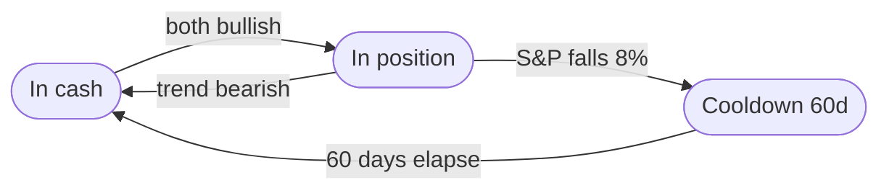

# Trailing Stop — Crash Protection (Layer 3)

[← Back to README](../../README.md) · Related: [Methodology](methodology.md) · [Dual-Signal Agreement](dual-signal-agreement.md) · [Velocity Stop](velocity-stop.md) · [Tax Treatment](tax-treatment.md)

The [core trend signal](core-trend-signal.md) is deliberately slow, so a sharp crash can inflict heavy damage before it confirms a bearish turn. The trailing stop is a faster safety net on top:

*   While in a position, track the **running peak of the (unleveraged) S&P 500 price** since entry.
*   The day the S&P closes **8% below that peak**, exit immediately — bypassing the dual-signal delay entirely.
*   After a stop-triggered exit, block re-entry for a **60-trading-day cooldown**, so a still-elevated trend signal doesn't buy straight back into a falling market.

It tracks the *unleveraged* S&P price, not the 3x equity curve — the leveraged curve swings ~3× as hard and would trip the stop constantly. The stop is opt-in; `bot.py` runs it at 8% / 60d.

The **recommended action** is "in the market" only when both indices agree bullish **and** the trailing stop has not fired. The daily report prints this action twice — once for a **tax-advantaged account** (with the trailing stop) and once for a **taxable account** (dual-signal only, *without* the stop), because [Table 8](tax-treatment.md) shows the stop's extra turnover is a net-negative return trade after tax.

The trailing-stop overlay rows on the two most relevant setups (S&P-signal [T+2] and dual-signal agreement) are shown in **[Table 4](dual-signal-agreement.md)** — Worst DD -64.78% vs. -83% to -85% for every no-stop setup, for roughly double the trading and a near-flat return effect.

---

## Backtest Results

Rolling 26-year methodology per [Methodology](methodology.md).

### Table 5: 3x ^NDX (TQQQ) — Drawdown by Crash Event (Event-Relative Peak-to-Trough)
*^NDX base, 3x leverage, S&P 500 signal. Each cell is the equity decline from just before the event to the local trough within the event window — a direct read of how the [Table 4](dual-signal-agreement.md) setups weathered the five worst crashes in the sample. Less negative = better protected. Generated by `backtest/crash_event_drawdown.py`.*

> **The trailing stop is the single largest drawdown reducer in every crash**, and it helps all five with none worsened: Black Monday -66% -> -20%, dot-com -83% -> -51%, COVID -70% -> -43%. **Buy & Hold at 3x is ruinous** — the dot-com crash took it to -99.95% (near-total wipeout), the floor the trend rules improve on. The two stopped setups are nearly identical (the ^GSPC stop dominates the crash profile regardless of entry rule; only 2008 differs), and dual-signal without a stop is slightly *worse* than the S&P signal in 2008/2022 — the higher-return, higher-drawdown trade the stop then closes. Rows E and F add the velocity (fixed-window) stop; see [Velocity Stop](velocity-stop.md) for the read across both this crash-event lens and the rolling-return lens.

| Setup | Black Monday 1987 | Dot-com crash | 2008 GFC | COVID crash | 2022 rate-shock bear |
| :--- | ---: | ---: | ---: | ---: | ---: |
| Buy & Hold (3x) | -83.66% | -99.95% | -94.57% | -69.96% | -80.15% |
| A: S&P 500 signal [T+2] (baseline) | -65.91% | -83.25% | -31.77% | -69.61% | -51.69% |
| B: S&P 500 signal [T+2] + Trailing Stop 8%/60d | **-19.55%** | **-51.11%** | **-17.95%** | **-42.69%** | **-38.06%** |
| C: Dual-signal agreement | -65.91% | -83.65% | -43.69% | -69.96% | -53.33% |
| D: Dual-signal agreement + Trailing Stop 8%/60d | -19.55% | -51.11% | -23.88% | -42.69% | -38.06% |
| E: Dual-signal agreement + Velocity Stop 6%/60d rolling_max | -15.47% | **-6.45%** | -21.42% | **-25.58%** | -30.03% |
| F: Dual-signal agreement + Velocity Stop 6%/30d point_to_point | -19.55% | -43.48% | **-11.16%** | -42.69% | -38.06% |

---

## Further reading

The trailing stop is the most heavily validated component in the system. Its full finding chain:

- [Trailing-stop-loss finding (2026-08-01)](../trailing-stop-loss-finding-2026-08-01.md) — the core finding.
- [Out-of-sample validation (2026-08-02)](../trailing-stop-loss-out-of-sample-2026-08-02.md) — generalization.
- [Tax-aware out-of-sample (2026-08-02)](../trailing-stop-loss-tax-aware-out-of-sample-2026-08-02.md)
- [Region validation (2026-08-03)](../trailing-stop-loss-region-validation-2026-08-03.md) — parameter stability across a region.
- [Stability probe (2026-08-03)](../trailing-stop-stability-probe-2026-08-03.md)
- [Combined system comparison (2026-08-03)](../combined-system-comparison-2026-08-03.md)
- [Overlay comparison, rolling (2026-08-03)](../overlay-comparison-rolling-2026-08-03.md)
